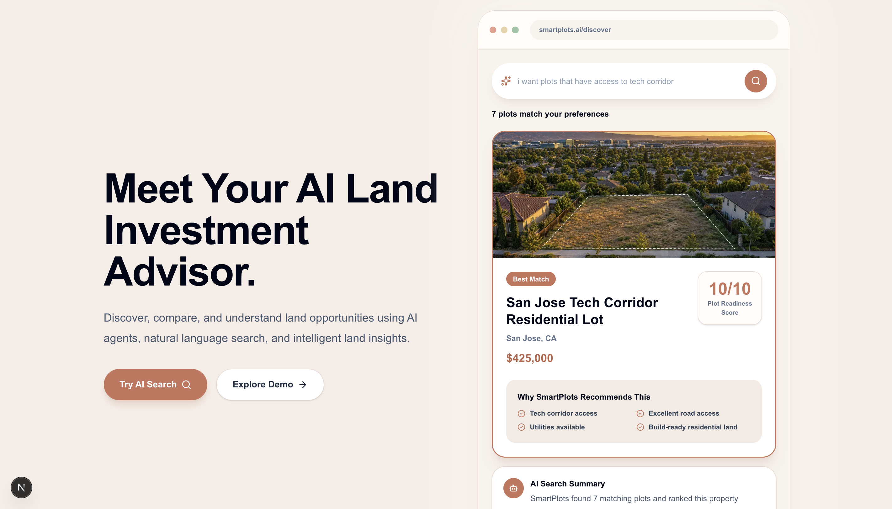
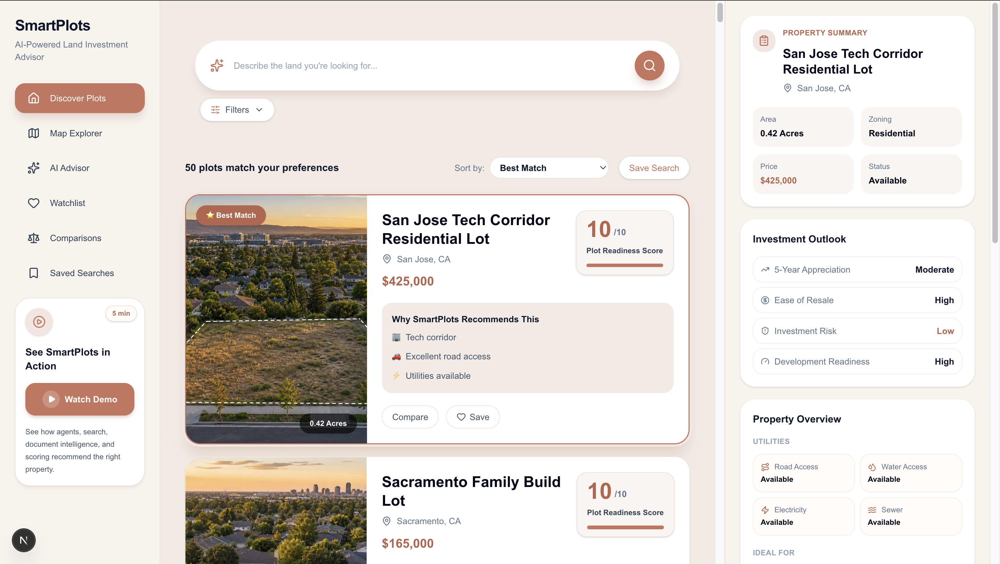
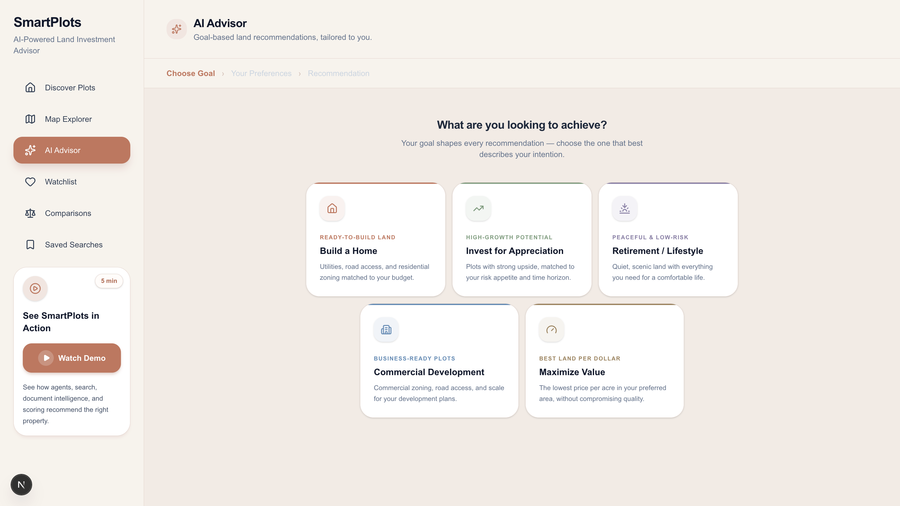
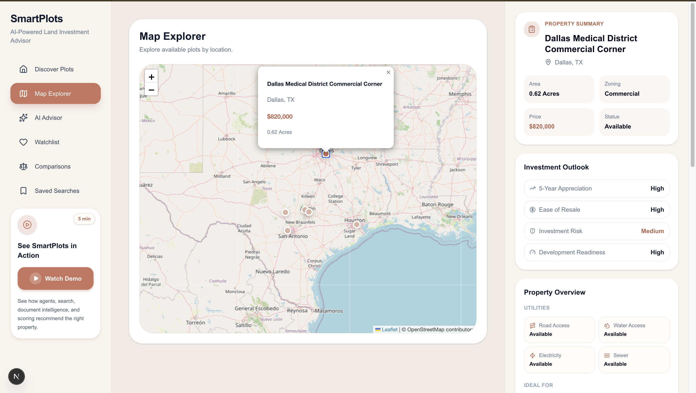
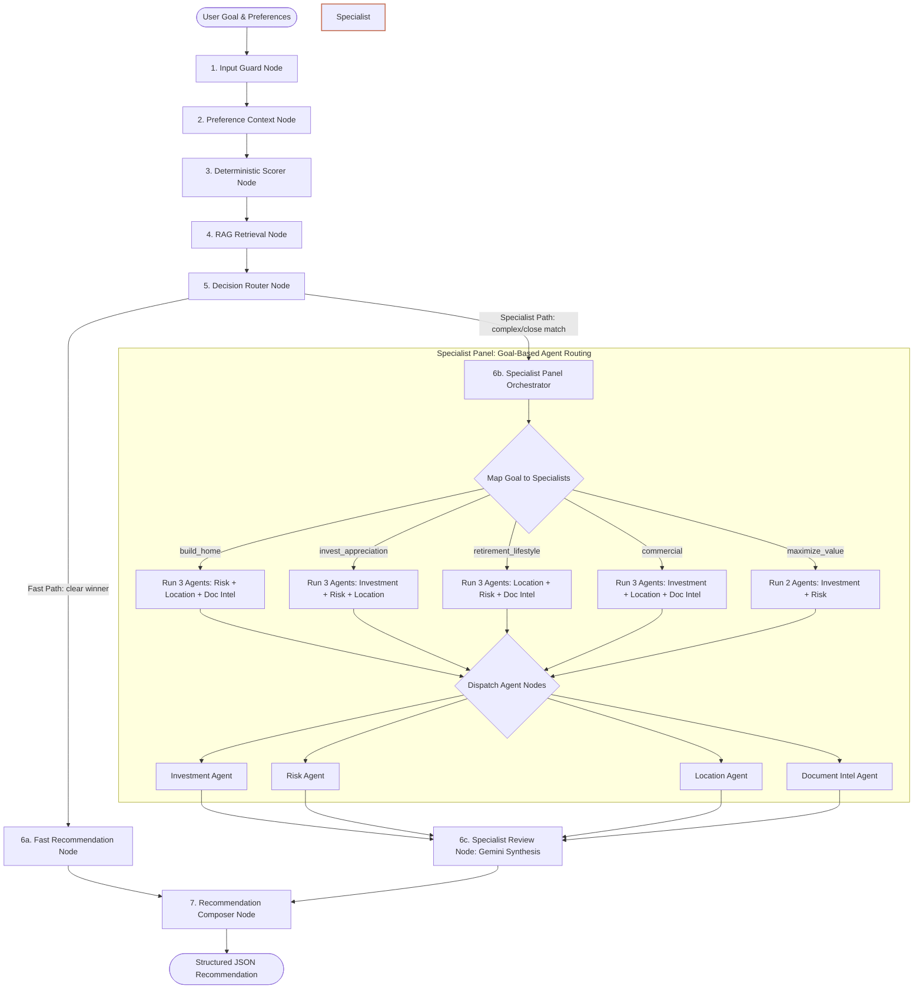

# SmartPlots

### AI-Powered Real Estate & Land Intelligence  
*Find Your Plot, Smarter.*

SmartPlots is an AI-powered real estate intelligence platform that helps users discover, analyze, and evaluate land plots. Navigating zoning ordinaces, utility access, deed restrictions, and long-term appreciation is notoriously complex. SmartPlots combines structured database queries with a state-of-the-art **multi-agent AI pipeline** to deliver instant, customized real estate advice.

---

## 📸 Screenshots
### Landing Page


### Discover Listings Dashboard


### AI Advisor


### Interactive Map Explorer


---

## 🏗️ System Architecture

SmartPlots features four core intelligent workflows powered by FastAPI, PostgreSQL (pgvector), and Google ADK (Agent Development Kit).

```text
                        Next.js / TypeScript Frontend
                                      │
                         FastAPI Backend API Layer
      ┌───────────────────────┬───────┴───────────────┬──────────────────────┐
      ▼                       ▼                       ▼                      ▼
DiscoverPlots            Comparison               AI Advisor              HITL Loop
(Semantic Search)        (Side-by-Side)       (ADK Graph Workflow)     (Feedback Re-run)
      │                       │                       │                      │
      ▼                       ▼                       ▼                      ▼
pgvector Search          Gemini LLM             Parallel Panel         State Update
 (PostgreSQL)          (Structured JSON)      (4 Specialist Nodes)      (& Re-score)
```

### 🔍 1. DiscoverPlots (Semantic Search Pipeline)
Translates natural-language search queries into structured database queries combined with vector similarity search.
*   **Query Parsing**: The `ai_search_agent` takes the raw user query (e.g. *"wooded acreage in WA with road access"*) and extracts structured attributes.
*   **Vector Database Search**: Leverages PostgreSQL + `pgvector` to run a cosine-similarity query across plot descriptions alongside hard filters.
*   **Ranking Explanation**: The `ai_search_ranking_explainer_agent` takes the top results and writes a concise natural-language explanation explaining *why* they were matched and ranked.

### 📊 2. Comparison Engine
Enables side-by-side analysis of multiple plots against a user's specified goal.
*   **Data Aggregation**: Standardizes and formats multiple plot attributes (acres, pricing, road access, utilities, and known risks) into a unified text block.
*   **Structured Analysis**: Invokes Gemini (`gemini-2.5-flash`) with a strict schema constraint (`ComparisonResponse`).
*   **Outputs**: Assigns custom "awards" to each plot (e.g. *"Lowest Risk"* or *"Best Value"*) and provides a detailed breakdown of pros and cons relative to the user's specific goals.

---

### 🧠 3. AI Advisor (ADK Graph Workflow)

The AI Advisor uses a directed-graph state machine where state flows through sequential execution nodes. Depending on the score margin and the user's goal complexity, it dynamically decides to route requests through a lightweight path or a comprehensive multi-agent specialist panel.

#### Complete Workflow Diagram



#### Goal-to-Agent Routing Rules
To minimize tokens and latency, the Specialist Panel only runs the domain agents relevant to the user's selected goal:

| Goal (`GoalKey`) | Number of Active Agents | Executed Agent Nodes | Agent Responsibility |
| :--- | :---: | :--- | :--- |
| `build_home` | **3** | Risk, Location, Document Intelligence | Evaluates local soil/flooding hazards, school proximity, accessibility, and crawls deed HOA zoning restrictions from raw PDFs. |
| `invest_appreciation` | **3** | Investment, Risk, Location | Analyzes holding timelines, price/acre vs market norms, long-term zoning changes, and proximity to regional growth indicators. |
| `retirement_lifestyle` | **3** | Location, Risk, Document Intelligence | Prioritizes quiet neighborhood noise ratings, access to medical facilities, utility reliability, and HOA land usage restrictions. |
| `commercial` | **3** | Investment, Location, Document Intelligence | Evaluates development readiness, road frontage easements, traffic flow proximity, and commercial zoning guidelines inside municipal code PDFs. |
| `maximize_value` | **2** | Investment, Risk | Direct comparison of price-per-acre margins, utility readiness, and critical infrastructure risk adjustments. |

*   **Fast Path**: Triggered when a single plot scores high ($\ge$ 8.5), has a clear margin over the second-best plot ($\ge$ 1.0), and has zero preflight notices. It calls Gemini once to generate a brief recommendation layout.
*   **Specialist Path**: Triggered when scores are close, warnings are present, or a complex/refinement goal is submitted. Runs the selected specialized agents before calling Gemini to compile a comprehensive, cited recommendation.

---

### 🔄 4. Human-in-the-Loop (HITL) Feedback Loop
Enables conversational preference adjustment and interactive recommendation refinement.
*   **Feedback Mapping**: Translates user corrections (e.g., *"This is too expensive"* or *"I need electricity"*) into updated query constraints.
*   **Workflow Re-entry**: Session states are updated in the database, and a refinement workflow is triggered.
*   **Forced Specialist Route**: Refinement passes are routed strictly through the **Specialist Path** to re-analyze alternatives carefully and detail the tradeoffs of the new recommendation.

---

## 🛠️ Tech Stack & Infrastructure

*   **Frontend**: Next.js (TypeScript), Tailwind CSS, Leaflet Maps (Deployed & Hosted on **Vercel**)
*   **Backend**: FastAPI (Python), SQLAlchemy, PostgreSQL + `pgvector` (Deployed on **GCP Cloud Run**)
*   **Database**: **GCP Cloud SQL (PostgreSQL)** with `pgvector` enabled for production, local PostgreSQL via Docker for development
*   **AI/LLM**: Google ADK (Agent Development Kit), Gemini 2.5 Flash


---

## 🚀 Getting Started

### Prerequisites

Ensure you have the following installed locally:
*   [Docker](https://www.docker.com/)
*   [Python 3.10+](https://www.python.org/downloads/)
*   [Node.js 18+](https://nodejs.org/)

---

### Step 1: Clone the Repository & Configure Environment

1. Clone the project:
   ```bash
   git clone https://github.com/SwarnaMadhuriP/smartplots.git
   cd smartplots
   ```
2. Configure your environment variables:
   ```bash
   cp .env.example .env
   ```
3. Open the `.env` file and insert your Gemini API Key:
   ```env
   GEMINI_API_KEY=your-actual-gemini-api-key
   ```

---

### Step 2: Spin Up the PostgreSQL Database

Start the database container (includes the `pgvector` extension):
```bash
docker compose up -d
```

---

### Step 3: Run the Backend API

1. Navigate to the backend directory and set up a virtual environment:
   ```bash
   cd backend
   python -m venv .venv
   source .venv/bin/activate  # On Windows: .venv\Scripts\activate
   ```
2. Install Python dependencies:
   ```bash
   pip install -r requirements.txt
   ```
3. Run the database migrations & seed scripts:
   *   **Seed listings**:
       ```bash
       python seed/seed_plots.py
       ```
   *   **Ingest documents for RAG (vector store embeddings)**:
       ```bash
       python seed/ingest_plot_documents.py
       ```
4. Start the FastAPI server:
   ```bash
   uvicorn app.main:app --reload
   ```
   *   *Backend API runs at: http://localhost:8000*
   *   *Swagger Docs: http://localhost:8000/docs*

---

### Step 4: Run the Frontend Application

1. Open a new terminal window and navigate to the frontend directory:
   ```bash
   cd frontend
   ```
2. Install dependencies:
   ```bash
   npm install
   ```
3. Start the Next.js development server:
   ```bash
   npm run dev
   ```
   *   *Frontend app runs at: http://localhost:3000*

---

## 🔮 Future Enhancements

*   **⚡ Pub/Sub Event-Driven Agents**: Transition to an event-driven architecture (using Redis or Cloud Pub/Sub). When a new plot is added to the database, background agents automatically trigger to vectorize attached documents, run baseline investment/risk evaluations, and notify matched users with saved searches.
*   **🔒 Security & Prompt Guardrails**: Introduce robust prompt injection protection and sandbox agent tool execution. Ensure strict data isolation so that raw zoning reports or private deeds uploaded by one user are not accessible during other users' RAG queries.
*   **🔌 Real-Time Data Integration**: Replace the static mock database seeds with direct API connections to live real estate platforms, county tax assessor portals, and municipal zoning databases to ensure real-time valuation and pricing accuracy.
*   **🗺️ GIS & Spatial Mapping Overlays**: Add Leaflet map layer overlays for flood zones, municipal zoning classifications, wetlands, and topographic contours, enabling the Risk and Location Agents to run precise spatial intersection calculations.
*   **🌐 Internationalization & Language Support**: Add full localization support to the frontend and configure the AI agents to accept queries and generate synthesized recommendations in multiple languages to support international land buyers.

